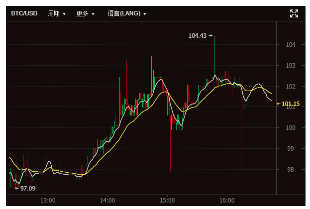
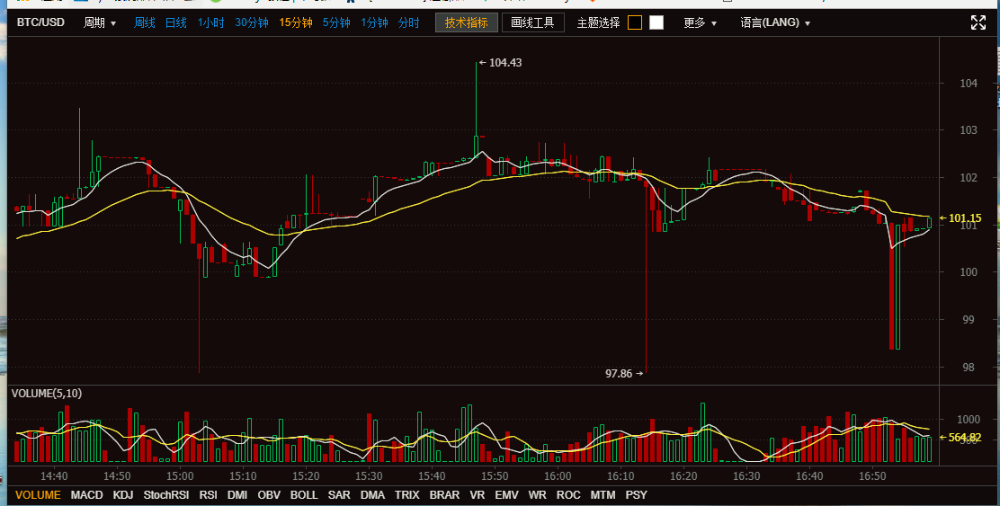

# react-kline     [](https://badge.fury.io/js/react-kline)

[](https://www.npmjs.com/package/react-kline)

> 基于React的K线图组件

### 演示地址

* [Demo](https://lindakai2016.github.io/react-kline/index.html)

### Features

    ✅ 支持两种主题配色切换 
    ✅ 支持简体中文,英文,繁体中文三种语言 
    ✅ 可配置的时间聚合方式
    ✅ 支持多种画线工具
    ✅ 支持多种画图算法
    ✅ 支持深度图数据及最近成交数据展示
    ✅ 支持普通轮询和Websocket Over Stomp两种连接方式

### ScreenShot!





### Install & Load

安装

```bash
$ npm install react-kline
```

* 使用

```html
    import React from 'react';
    import ReactDOM from 'react-dom';
    import ReactKline from 'react-kline';

    class App extends React.Component {
        render() {
            return (
                <ReactKline
                    width={600}
                    height={400}
                    ranges={["1w", "1d", "1h", "30m", "15m", "5m", "1m", "line"]}
                    symbol={"BTC"}
                    symbolName={"BTC/USD"}
                    intervalTime={5000}
                    showDepth={false}
                    depthWidth={50}
                    type={"poll"}
                    url={"/example/src/mock.json"}
                />
            );
        }
    }

    ReactDOM.render(
        <App />,
        document.getElementById('root')
    );
```

### Examples

* Poll(轮询)

```javascript
    type={"poll"}
    url={"http://127.0.0.1/mock.json"}
```

* Stomp Over Websocket

```javascript
   type={"stomp"}
   url: {"http://127.0.0.1:8088/socket"}
   subscribePath={"/kline/subscribe"}
   sendPath={"/kline/send" }
```


### Support Options

| 参数名称   | 参数说明          |   默认值
|:---------|:-----------------|:------------
|`element` | 容器元素选择器     | #kline_container
|`width`   | 宽度 (px)         | 1200
|`height`   | 高度度 (px)      | 650
|`theme`   | 主题 dark(暗色)/light(亮色) | dark
|`language` | 语言 zh-cn(简体中文)/en-us(英文)/zh-tw(繁体中文) | zh-cn
|`ranges` | 聚合选项 1w/1d/12h/6h/4h/2h/1h/30m/15m/5m/3m/1m/line (w:周, d:天, h:小时, m:分钟, line:分时数据) | ["1w", "1d", "1h", "30m", "15m", "5m", "1m", "line"]
|`symbol` | 交易代号 | 
|`symbolName`  | 交易名称 | 
|`type`  | 连接类型 stomp/poll(轮询) |  poll
|`url`  | 请求地址 | 
|`limit`  | 分页大小 | 1000
|`intervalTime`  | 请求间隔时间(ms) | 3000
|`subscribePath`   | 订阅地址 (仅stomp方式需要) | 
|`sendPath`   | 发送地址 (仅stomp方式需要) | 
|`debug`   | 是否开启调试模式 true/false |  true
|`reverseColor`   | 是否反色, 默认绿涨红跌 true/false | false
|`stompClient`   | stomp 连接对象 | null
|`showDepth`   | 是否显示深度图 | false
|`depthWidth`   | 深度图宽度 | 最小50，小于50则取50，默认50


### Methods

* draw()

    画K线图

```javascript
draw();
```

* resize(int width, int height)

    设置画布大小

```javascript
resize(1200, 550);
```

* setSymbol(string symbol, string symbolName)

    设置交易品种

```javascript
setSymbol('usd/btc', 'USD/BTC');
```

* setTheme(string style)

    设置主题

```javascript
setTheme('dark');  // dark/light
```

* setLanguage(string lang)

    设置语言

```javascript
setLanguage('en-us');  // en-us/zh-ch/zh-tw
```

* setIntervalTime: function (intervalTime) 

    设置请求间隔时间(ms)

```javascript
setIntervalTime(5000);
```

* Kline.setDepth: function(showDepth,depthWidth)

    设置深度图

```javascript
setDepth(true,50);
```

* connect: function () 

    建立socket连接

```javascript
connect();
```

* disconnect: function () 

    断开socket连接

```javascript
disconnect();
```

* pause: function () 

    暂停请求数据

```javascript
pause();
```

* resend: function () 

    重新请求数据

```javascript
resend();
```

### Events

| 事件函数                 |   说明
|:-----------------------|:------------
| `onResize: function(width, height)`   | 画布尺寸改变时触发
| `onLangChange: function(lang)`   | 语言改变时触发
| `onSymbolChange: function(symbol, symbolName)`   | 交易品种改变时触发
| `onThemeChange: function(theme)`   | 主题改变时触发
| `onRangeChange: function(range)`   | 聚合时间改变时触发


### Response

> Example

```json
{
  "success": true,
  "data": {
    "lines": [
      [
        1.50790476E12,
        99.30597249871,
        99.30597249871,
        99.30597249871,
        99.30597249871,
        66.9905449283
      ]
    ],
    "depths": {
      "asks": [
        [
          500654.27,
          0.5
        ]
      ],
      "bids": [
        [
          5798.79,
          0.013
        ]
      ]
    }
  }
}
```

* 响应参数说明:

* `lines`: K线图, 依次是: 时间(ms), 开盘价, 最高价, 最低价, 收盘价, 成交量
* `depths`(可选, 行情侧边栏显示): 深度图数据,  `asks`:一定比例的卖单列表, `bids`:一定比例的买单列表, 其中每项的值依次是 成交价, 成交量